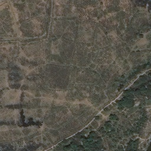
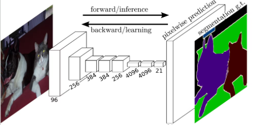
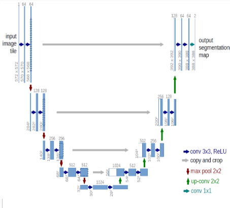

# Semantic Image Segmentation for Forest Cover Mapping#

This project implements an image segmentation model to map forest cover from satellite images using deep learning techniques. The goal is to accurately distinguish between forested and non-forested areas, providing insights into deforestation and land use patterns.

Table of Contents
## Table of Contents
1. [Problem Statement](#problem-statement)
2. [Data](#data)
3. [Model Architecture](#model-architecture)
4. [Evaluation](#evaluation)
5. [Model Performance](#model-performance)
6. [Contributing](#contributing)
7. [License](#license)
8. [Contact Information](#contact-information)

## 1. Problem Statement
  Accurate information on forest cover is important for supporting forest conservation and management efforts. Traditional methods of determining forest cover such as ground-based surveys are very tedious, expensive and time consuming.
  
  Advanced methods, such as remote sensing coupled with robust geographical information systems (GIS) present an opportunity for cost effective and large scale forest cover mapping. However they still rely on very simple classification algorithms and require experts to manually draw polygons over the various classes (Gachuhi & Kibui, 2024). Other advanced approaches to forest mapping involve using indices derived from satellite imagery such as the Normalised Difference Vegetative Index (NDVI), but this too is prone to inaccuracies because it is easily affected by conditions such as soil moisture and NDVI cannot differentiate between very similar classes such as  a shrub and a forest (Cropin, 2021).
  
  To counter these limitations, deep learning techniques can be used to automate the process of identifying forested areas from satellite images. One such technique is semantic segmentation which is a computer vision task that classifies each pixel in an input image into specific classes resulting in a dense pixel-wise feature map.
This project will evaluate the performance of two semantic segmentation models in identifying forest cover from satellite images

## 2.Data
The dataset used for this project consists of satellite images and their corresponding masks, where each mask labels the pixels as either forest or non-forest as seen in the sample images below

| Satellite Image | Coresponding mask |
|:--------------:|:--------------:|
|  |  |

## 3. Model Architecture
This project implements two computer vision models for the segmentation task, that is a fully convolutional network and the Unet architecture. This section will explain the architecture of each.

### Fully Convolutional Network
Unlike the traditional Convolutional Neural Network (CNNs), FCNs are only comprised on convolutional layers and do not have a fully conected layer. This means they are able to retain spatial information on top of feature extraction.
A FCN consists of 2 main parts:
1. Downsampling path(Encoder)
The encoding path is made up of several convolutional layers, which extract features from the input image while reducing its spatial dimensions (low resolution).
3. Upsampling path (Decoder)
The decoding path is made up of several transpose convolutional layers,that increase the spatial dimensions of the feature map-output of the convolutional layer.

 

### Unet Model
The Unet model is similar to FCN in that it is also comprised on a downsampling and upsampling path. However, its definitive characteristic is skip connections. Skip connections reintroduces features into the upsampling path, by joining the feature map from every encoder is incorporated in its corresponding decoder.

 
 
## 4. Evaluation 
During training, each model was evaluated based on pixel accuracy, that is the percentage of pixels in the image which were correctly classified either as forested or non-forested areas. After hyperparameter tuning, the best performing model was then evaluated based on both accuracy and intersection over union.

## 5. Model Performance

## 6. Contributing

## 7. License

